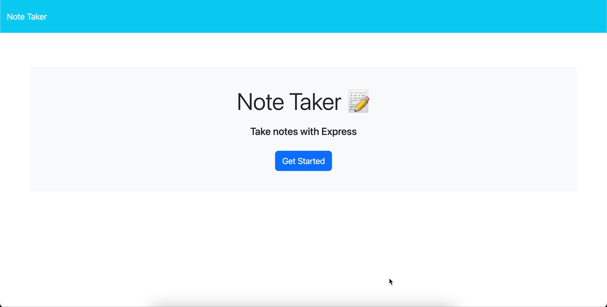

 # NoteTaker

## Description

This is project, will allow you to create notes.Render selecting note and delete notes

## Table of Contents (Optional)

If your README is long, add a table of contents to make it easy for users to find what they need.

- [Installation](#installation)
- [Usage](#usage)
- [Credits](#credits)
- [License](#license)

## Installation

https://rendernotetaker-1.onrender.com

## Usage

 visit https://rendernotetaker-1.onrender.com
    

## License

## Badges

